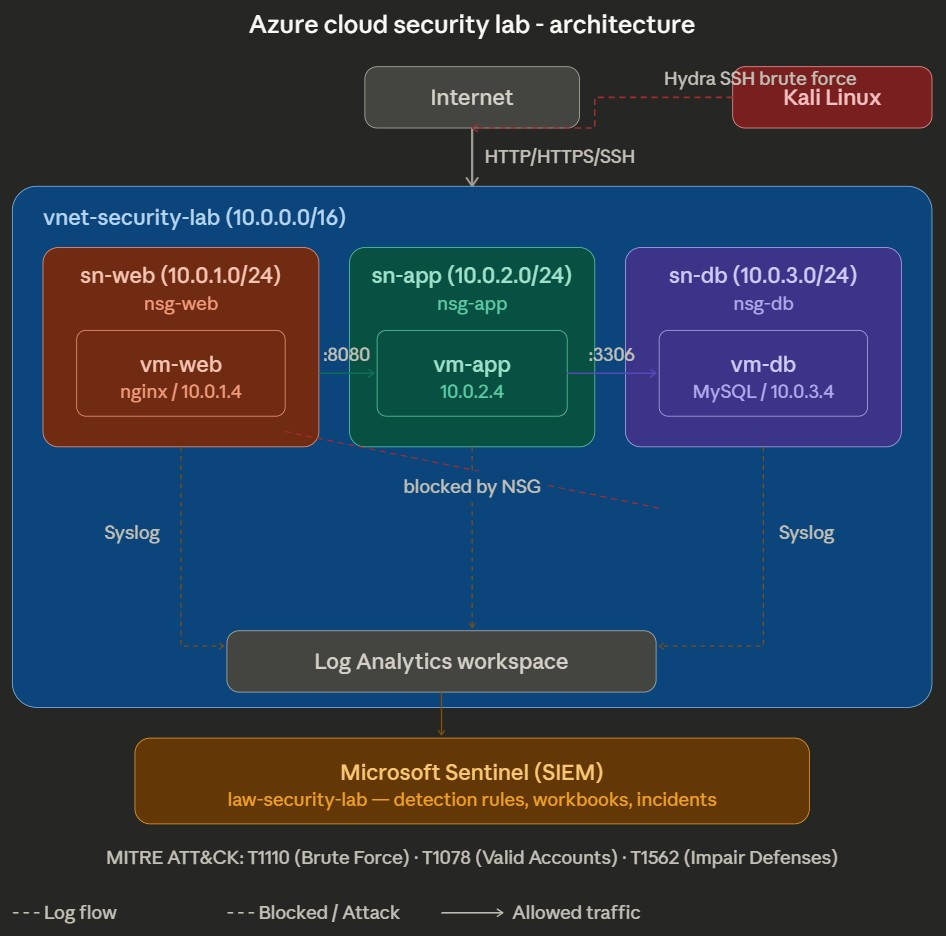

Azure Cloud Security Lab
A hands-on security monitoring environment built in Microsoft Azure, demonstrating network segmentation, SIEM deployment, threat detection, and incident response mapped to the MITRE ATT&CK framework.

Architecture

