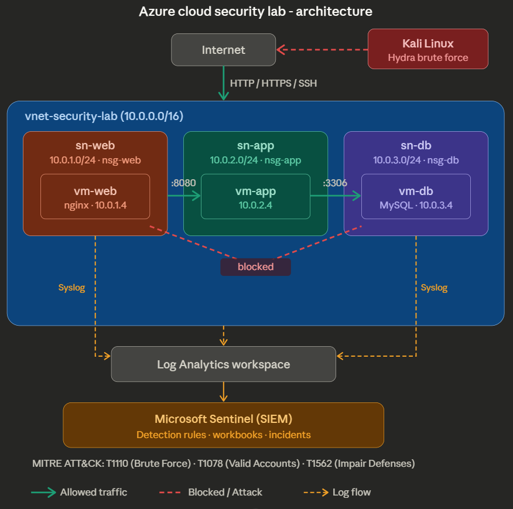

# Azure Cloud Security Lab

A hands-on security monitoring environment built in Microsoft Azure, demonstrating network segmentation, SIEM deployment, threat detection, and incident response — mapped to the MITRE ATT&CK framework.

## Architecture



The lab implements a classic **3-tier network architecture** with defense-in-depth principles:

| Tier | Subnet | NSG | Purpose |
|------|--------|-----|---------|
| **DMZ** | sn-web (10.0.1.0/24) | nsg-web | Internet-facing web server (nginx). Only tier exposed to public traffic (HTTP/HTTPS). SSH restricted to operator IP. |
| **Application** | sn-app (10.0.2.0/24) | nsg-app | Internal application logic. Accepts traffic only from sn-web on port 8080. No public IP. |
| **Database** | sn-db (10.0.3.0/24) | nsg-db | Data storage tier. Accepts only MySQL (3306) from sn-app. No public IP. All other inbound traffic denied. |

All resources are deployed in **Norway East** under a single resource group (`rg-security-lab`).

## What I Built

### Network Security
- **Virtual Network** with 3 isolated subnets and dedicated NSGs per tier
- **Least privilege NSG rules** — each tier only allows the minimum required ports from the expected source
- **Verified segmentation** — confirmed that web-tier can SSH to app-tier, but cannot reach db-tier directly

### SIEM & Monitoring
- **Microsoft Sentinel** connected to a Log Analytics workspace (`law-security-lab`)
- **Azure Monitor Agent** deployed on all 3 VMs via Data Collection Rules, forwarding syslog (auth, daemon, cron, kern) to Sentinel
- **Azure Activity connector** streaming subscription-level events for change detection

### Detection Engineering
Four custom analytics rules, each mapped to MITRE ATT&CK:

| Rule | Severity | MITRE Technique | What It Detects |
|------|----------|-----------------|-----------------|
| Brute Force SSH Attempt Detected | High | T1110 — Brute Force | 5+ failed auth attempts from a single IP within 5 minutes |
| Successful SSH Login — Monitor | Medium | T1078 — Valid Accounts | Any accepted SSH session (for baselining and anomaly review) |
| NSG Rule Modified | High | T1562 — Impair Defenses | Changes to network security group rules (potential firewall tampering) |
| Advanced Multistage Attack Detection | High | Multiple | Built-in Fusion rule correlating signals across kill chain stages |

### Attack Simulation
- Executed an **SSH brute force attack** from Kali Linux using Hydra against the web server
- Generated **2,350+ failed authentication events** captured in Sentinel
- Confirmed detection rule triggered and created incidents in the Sentinel incident queue

### Visualization
- **Security Overview Dashboard** (Sentinel Workbook) with:
  - Time chart of failed authentication attempts over time
  - Bar chart showing top attacker IPs by volume
  - Pie chart of successful logins by host

## Key KQL Queries

### Brute force detection
```kql
Syslog
| where Facility == "auth"
| where SyslogMessage contains "Failed" or SyslogMessage contains "Authentication failure"
| summarize FailedAttempts = count() by SrcIP = extract("from ([0-9.]+)", 1, SyslogMessage), HostName
| where FailedAttempts >= 5
```

### Successful login monitoring
```kql
Syslog
| where Facility == "auth"
| where SyslogMessage contains "Accepted"
| extend SourceIP = extract("from ([0-9.]+)", 1, SyslogMessage)
| extend User = extract("for ([a-zA-Z0-9_]+)", 1, SyslogMessage)
| project TimeGenerated, HostName, User, SourceIP, SyslogMessage
```

### NSG change detection
```kql
AzureActivity
| where OperationNameValue contains "MICROSOFT.NETWORK/NETWORKSECURITYGROUPS"
| where ActivityStatusValue == "Success"
| project TimeGenerated, Caller, OperationNameValue, ResourceGroup, Properties
```

### Auth event overview
```kql
Syslog
| where Facility == "auth"
| summarize count() by bin(TimeGenerated, 1h)
| render timechart
```

| Screenshot | Description |
|------------|-------------|
| [Architecture](screenshots/infrastructure/architecture-diagram.png) | Full lab architecture diagram |
| [Resource Group](screenshots/infrastructure/resource-group-overview.jpg) | All resources in rg-security-lab |
| [Nginx](screenshots/infrastructure/nginx.jpg) | Web server accessible on port 80 through NSG |
| [Segmentation Test](screenshots/network/segmentation-test.jpg) | SSH to app-tier succeeds, db-tier blocked — proving NSG enforcement |
| [Analytics Rules](screenshots/sentinel/analytics-rules.jpg) | 4 active detection rules mapped to MITRE ATT&CK |
| [Sentinel Logs](screenshots/sentinel/sentinel-logs.jpg) | 2,350+ failed auth events captured in real-time |
| [Incidents](screenshots/sentinel/incidents.jpg) | Incidents triggered by detection rules |
| [Dashboard](screenshots/sentinel/dashboard.jpg) | Security Overview Dashboard visualizing attack data |
| [Hydra Attack](screenshots/attack-simulation/hydra.jpg) | Brute force attack from Kali Linux |

## Tools & Technologies

- **Cloud:** Microsoft Azure (VNet, NSG, VMs, Sentinel, Log Analytics, Azure Monitor Agent)
- **SIEM:** Microsoft Sentinel with KQL
- **Attack Simulation:** Kali Linux, Hydra
- **Web Server:** nginx on Ubuntu Server 24.04 LTS
- **Framework:** MITRE ATT&CK

## Lessons Learned

- **Dynamic IP challenge:** My public IP changed between sessions, locking me out of SSH. In production, Azure Bastion or a VPN gateway would solve this. Documenting this as a real operational consideration.
- **Log ingestion delay:** Azure Monitor Agent takes 15-30 minutes to start forwarding data after deployment. Initial attack simulation ran before logs were flowing — had to re-run after confirming ingestion.
- **Auth log format:** Ubuntu 24.04 uses "Failed keyboard-interactive/pam" instead of "Failed password" for password-based SSH failures. Detection rules must account for vendor-specific log formats.
- **NSG rule ordering:** Lower priority numbers are evaluated first. Keeping deny-all at 4096 leaves room for future allow rules without restructuring.

## About Me

**Erik Helander Bolme** — Bachelor student in Cybersecurity at Høyskolen Kristiania. Background as Information Manager and data security lead in the Norwegian Armed Forces, with hands-on experience in RBAC, access management, and security routines in classified environments.

- [LinkedIn](https://linkedin.com)
- erikbolme@hotmail.com
